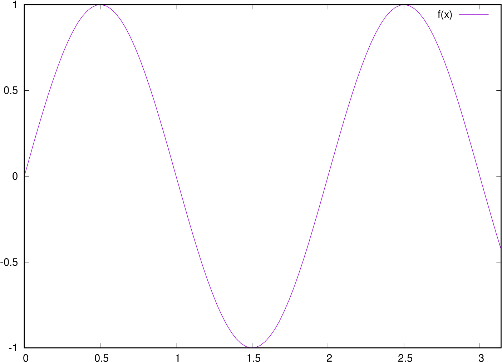
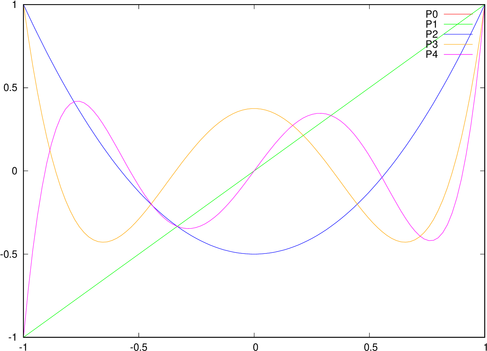

# tecCmd
tecCmd is a utility for generating publication quality plots effortlessly. I wrote the script around 2018. I used it extensively during my PhD. 

I was using gnuplot initially for plotting data. Gnuplot is excellent. But the output files are not suitable for directly putting into publications. An another plotting software is Tecplot. It is extensively used in the field of computational fluid dynamics for visualization. Around 2018, Tecplot released a python API for their Tecplot-360. This means that we need not launch a GUI to plot data. The command line utilities are much more memory efficient. They also open up opportunities for automation using simple bash scripting. A Python API together with evil *eval* can be exploited for data manipulation. 

Features:
- Generate tecplot layout files using simple and intuitive scripting similar to gnuplot (see examples below)
- Column data can be manipulated in an arbitrary fashion, limited only by the capabilities of Python expression evaluation engine.
- Low memory footprint. Launching Tecplot over SSH is remarkably slow. You can instead write a simple script and directly generate the postscript files. 

It gets the job done. I wrote it on a Friday evening.

### Examples

See the examples directory for the input data files.

#### Example 1
Reading matrix from data.txt and plotting column 1 on x-axis and column 2 on y-axis.

<table>
<tr>
    <th> gnuplot </th>
    <th> tecCmd </th>
</tr>

<tr>
  <td><pre>

    set terminal postscript color
    set out 'gnuplot.ps'
    plot 'data.txt' u 1:2
    set out
    
  </pre></td>
  <td><pre>

    set out 'tecCmd.ps'
    plot 'data.txt' u 1:2
    set out
   
  </pre></td>
</tr>

<tr>
    <td></td>
    <td></td>
</tr>
</table>

#### Example 2
Using functions to transform the input matrix columns. In this example, I am reading matrix from data.txt, plotting column 1 on x-axis, and *sin(pi*$1)* on the y-axis. The syntax convention is close to gnuplot. Functions defined in numpy are available in global namespace and can be evaluated.

<table>
<tr>
    <th> gnuplot </th>
    <th> tecCmd </th>
</tr>

<tr>
  <td><pre>

    set terminal postscript color
    set out 'gnuplot.ps'
    set xrange [0:3.14]
    set yrange [-1:1]
    plot 'data.txt' u 1:(sin(pi*$1)) w l
    set out
    
  </pre></td>
  <td><pre>

    set out 'tecCmd.ps'
    set xrange [0:3.14]
    set yrange [-1:1]
    plot 'data.txt' u 1:(sin(pi*$1)) w l
    set out
   
  </pre></td>
</tr>

<tr>
    <td></td>
    <td></td>
</tr>
</table>

#### Example 3
Using user defined functions to transform the input matrix columns. 

<table>
<tr>
    <th> gnuplot </th>
    <th> tecCmd </th>
</tr>

<tr>
  <td><pre>

    set terminal postscript color
    set out 'gnuplot.ps'
    set xrange [0:3.14]
    set yrange [-1:1]
    f(x) = sin(pi*x)
    plot f(x) w l
    set out
    
  </pre></td>
  <td><pre>

    set out 'tecCmd.ps'
    set xrange [0:3.14]
    set yrange [-1:1]
    plot function("(x): return vstack((x, sin(pi*x))).T") u 1:2 w l
    set out
   
  </pre></td>
</tr>

<tr>
    <td></td>
    <td></td>
</tr>
</table>

#### Example 4
Plot multiple lines: [Legendre Polynomials](https://en.wikipedia.org/wiki/Legendre_polynomials).

<table>
<tr>
    <th> gnuplot </th>
    <th> tecCmd </th>
</tr>

<tr>
  <td><pre>

    set terminal postscript color
    set out 'gnuplot.ps'
    set xrange [-1:1]
    set yrange [-1:1]
    P0(x) = 1
    P1(x) = x
    P2(x) = 0.5*(3*x**2-1)
    P3(x) = (35*x**4-30*x**2+3)/8.
    P4(x) = (63*x**5-70*x**3+15*x)/8.
    plot P0(x) w l lc 'red' t 'P0', \
         P1(x) w l lc 'green' t 'P1', \
         P2(x) w l lc 'blue' t 'P2', \
         P3(x) w l lc 'orange' t 'P3', \
         P4(x) w l lc 'magenta' t 'P4'
    set out
    
  </pre></td>
  <td><pre>

    set out 'tecCmd.ps'
    set xrange [-1:1]
    set yrange [-1:1]
    keyword x=linspace(-1,1)
    keyword "def P0(x): return (x+1-x)"
    keyword "def P1(x): return x"
    keyword "def P2(x): return 0.5*(3*x**2-1)"
    keyword "def P3(x): return (35*x**4-30*x**2+3)/8."
    keyword "def P4(x): return (63*x**5-70*x**3+15*x)/8."
    plot function("(x): return vstack((x, P0(x))).T") u 1:2 w l lc 'red' t 'P0', \
         function("(x): return vstack((x, P1(x))).T") u 1:2 w l lc 'green' t 'P1', \
         function("(x): return vstack((x, P2(x))).T") u 1:2 w l lc 'blue' t 'P2', \
         function("(x): return vstack((x, P3(x))).T") u 1:2 w l lc 'orange' t 'P3', \
         function("(x): return vstack((x, P4(x))).T") u 1:2 w l lc 'magenta' t 'P4'
    set out
   
  </pre></td>
</tr>

<tr>
    <td></td>
    <td></td>
</tr>
</table>
